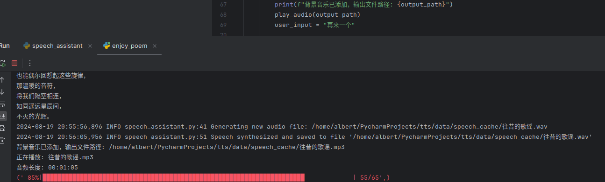

# 🎵 诗意对话生成器 🎤

欢迎来到诗意对话生成器，这是一个融合了人工智能、文学创作和音频合成的独特项目！让我们一起踏上一段充满诗意的旅程吧！

## 🌟 项目特色

- 🤖 利用 GPT-4 模型，以著名作家冰心的风格创作诗歌
- 🎙️ 将生成的诗歌转换成优美的语音
- 🎶 自动为语音添加背景音乐，营造氛围
- 📝 保存所有创作的诗歌和音频文件

## 🚀 如何使用

1. 确保你已经设置好了 Azure OpenAI 的凭证。
2. 运行主程序，开始你的诗意之旅！
3. 程序会自动生成诗歌，并将其转换为带背景音乐的语音。
4. 坐下来，放松，聆听美妙的诗歌朗诵吧！

## 🛠️ 主要功能

- `chat_with_gpt4()`: 与 GPT-4 模型对话，生成诗歌
- `add_background_music()`: 为语音添加背景音乐
- `play_audio()`: 播放生成的音频文件
- 自动保存生成的诗歌和音频文件路径

## 🌈 让我们开始吧！

运行程序，让 AI 为你创作随心所欲的诗歌。每次运行都会带来新的惊喜！

```python
python3 -m venv venv
source venv/bin/activate
pip install -r requirements.txt
python enjoy_poem.py
```

## 🎉 享受你的诗意时光！

无论你是文学爱好者、AI 探索者，还是只是想放松一下，这个项目都能带给你独特的体验。让我们一起在科技和文学的交汇处，创造些美好的事物吧！




> 点击 [这里](https://drive.google.com/drive/folders/1scL380OLMDsrr_0JeSu2lNCPqUBhGbkn?usp=sharing) 欣赏测试生成的音频文件。
> 
---

记得经常查看输出文件夹，你可能会发现意想不到的文学珍宝哦！🌠✨
